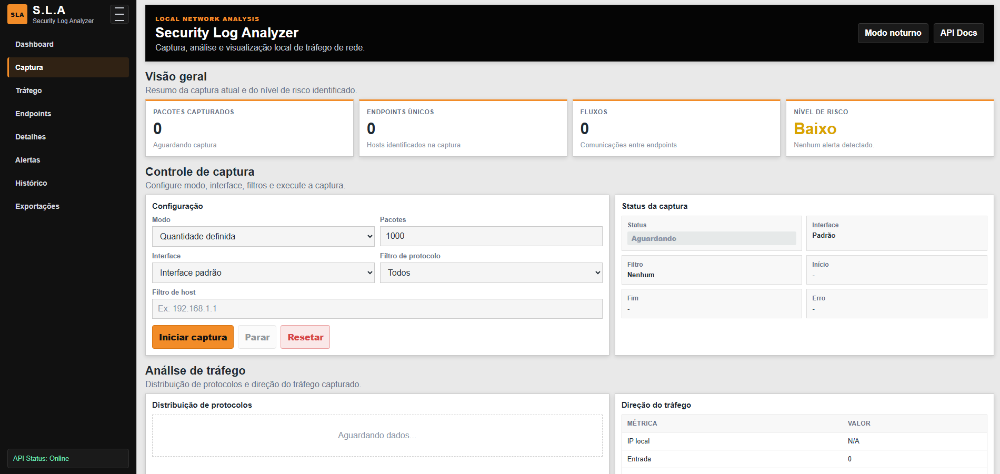

# S.L.A — Security Log Analyzer

**S.L.A — Security Log Analyzer** é uma aplicação web local para captura, análise e visualização de tráfego de rede. O projeto foi desenvolvido com **Python**, **FastAPI**, **Scapy**, **SQLite**, **HTML**, **CSS** e **JavaScript**, com foco em estudo prático de redes, cibersegurança defensiva e fundamentos de análise de tráfego.

<p align="center">
  
</p>

---

## Visão geral

O S.L.A nasceu como um projeto de estudo para transformar a captura de pacotes de rede em uma experiência mais visual, organizada e acessível. Em vez de analisar tudo apenas pelo terminal, a aplicação oferece um dashboard web local onde é possível iniciar capturas, aplicar filtros, acompanhar estatísticas, visualizar endpoints, observar fluxos de comunicação, consultar portas, analisar protocolos e exportar relatórios.

A proposta não é substituir ferramentas profissionais como Wireshark, tcpdump, Zeek ou soluções SIEM completas. A ideia é construir uma ferramenta autoral, didática e funcional, capaz de demonstrar como uma aplicação pode capturar tráfego de rede, processar os dados no backend, organizar os resultados em uma API e exibir tudo em uma interface web.

O projeto também funciona como uma ponte entre três áreas importantes: redes de computadores, desenvolvimento backend e cibersegurança defensiva. Ele mostra, na prática, como pacotes capturados podem ser transformados em informações úteis para análise.

---

## Utilidade do projeto

O S.L.A pode ser utilizado em ambientes controlados para entender o comportamento básico de uma rede local. Ao executar uma captura, a aplicação identifica protocolos, endpoints, fluxos, portas de destino, consultas DNS, flags TCP e estatísticas de tamanho dos pacotes.

Isso ajuda a responder perguntas como: quais hosts estão se comunicando, quais protocolos aparecem com mais frequência, quais portas estão sendo usadas, se há tráfego DNS visível, quais fluxos foram observados e se existe algum padrão simples que mereça atenção.

Para fins de estudo, o projeto é útil porque aproxima conceitos teóricos de redes da prática. Em vez de apenas ler sobre TCP, UDP, DNS, portas e pacotes, o usuário consegue visualizar esses elementos sendo extraídos de tráfego real da própria máquina ou de uma interface selecionada.

Para portfólio, o projeto demonstra a construção de uma ferramenta técnica completa, envolvendo captura de pacotes, análise de dados, API backend, persistência local, exportação de relatórios e interface web.

---

## Uso autorizado

Este projeto foi desenvolvido para fins educacionais, laboratoriais e defensivos.

A captura de pacotes deve ser feita apenas em redes próprias, ambientes de laboratório ou redes onde exista autorização explícita para análise. O tráfego de rede pode revelar informações sensíveis, como endereços IP, domínios acessados, portas utilizadas e padrões de comunicação.

O S.L.A deve ser usado de forma responsável e dentro dos limites legais e éticos.

---

## Como o projeto funciona

A aplicação é dividida em camadas. O **Scapy** é responsável pela captura dos pacotes. O backend em **FastAPI** controla o início e a parada das capturas, recebe os parâmetros enviados pela interface e disponibiliza os dados por meio de endpoints HTTP. A camada de análise processa os pacotes capturados e gera um relatório estruturado com informações relevantes sobre o tráfego.

Esse relatório é mantido no estado da aplicação e também pode ser salvo no histórico local usando **SQLite**. A interface web consome os dados da API periodicamente e atualiza o dashboard com cards, tabelas, status da captura e histórico de análises.

O fluxo principal pode ser entendido assim:

```text
Interface web
    ↓
FastAPI
    ↓
Serviço de captura
    ↓
Scapy
    ↓
Analisador de pacotes
    ↓
Relatório estruturado
    ↓
Dashboard, histórico e exportações
````

Essa organização separa responsabilidades importantes. A captura fica isolada no serviço de captura, a análise fica concentrada no analisador, o estado da aplicação fica em uma camada própria, as exportações ficam separadas e as rotas da API apenas conectam essas partes.

---

## Funcionalidades principais

O S.L.A permite realizar capturas por quantidade definida de pacotes ou em modo contínuo. No modo de quantidade definida, a aplicação encerra a captura automaticamente ao atingir o número configurado. No modo contínuo, a captura permanece ativa até o usuário solicitar a parada.

A aplicação também permite selecionar a interface de rede e aplicar filtros de captura por protocolo ou por host. Os filtros ajudam a reduzir o volume de dados capturados e permitem análises mais direcionadas, como observar apenas tráfego TCP, UDP, DNS, HTTP, HTTPS, ICMP ou tráfego relacionado a um IP específico.

Durante e após a captura, o dashboard apresenta informações como total de pacotes capturados, quantidade de endpoints identificados, número de fluxos observados, nível de risco básico, distribuição de protocolos, direção do tráfego, principais endpoints, principais fluxos, portas de destino, consultas DNS, flags TCP e estatísticas de tamanho dos pacotes.

O projeto também possui histórico persistente com SQLite. Isso permite manter registros das capturas realizadas mesmo após reiniciar a aplicação. Além disso, o relatório atual pode ser exportado em JSON, Markdown, Excel ou CSV compactado em ZIP.

---

## Tecnologias utilizadas

|Tecnologia|Uso no projeto|
|---|---|
|Python|Linguagem principal da aplicação|
|FastAPI|Criação da API e controle das rotas|
|Uvicorn|Servidor ASGI para executar a aplicação|
|Scapy|Captura e leitura dos pacotes de rede|
|SQLite|Persistência local do histórico de capturas|
|Pandas|Apoio na geração de relatórios em Excel|
|OpenPyXL|Escrita de arquivos `.xlsx`|
|HTML|Estrutura da interface web|
|CSS|Estilização do dashboard|
|JavaScript|Consumo da API e atualização dinâmica da interface|

---

## Estrutura do projeto

```text
security-log-analyzer/
│
├── app/
│   ├── __init__.py
│   ├── main.py
│   │
│   ├── api/
│   │   ├── __init__.py
│   │   └── routes.py
│   │
│   ├── core/
│   │   ├── __init__.py
│   │   ├── analyzer.py
│   │   ├── capture_service.py
│   │   ├── database.py
│   │   ├── exporters.py
│   │   └── state.py
│   │
│   ├── schemas/
│   │   ├── __init__.py
│   │   └── capture.py
│   │
│   └── static/
│       ├── index.html
│       ├── styles.css
│       └── app.js
│
├── assets/
│   └── dashboard.png
│
├── data/
│   └── .gitkeep
│
├── exports/
│   └── .gitkeep
│
├── requirements.txt
├── README.md
└── .gitignore
```

A pasta `app/core` concentra a lógica principal do sistema. O arquivo `capture_service.py` controla a captura em segundo plano, `analyzer.py` interpreta os pacotes, `state.py` mantém o estado atual da aplicação, `database.py` gerencia o SQLite e `exporters.py` gera os arquivos de exportação.

A pasta `app/api` contém as rotas da aplicação. A pasta `app/static` contém o frontend web. A pasta `data` é usada para armazenar o banco SQLite local, enquanto `exports` recebe os relatórios gerados pela aplicação. A pasta `assets` armazena imagens usadas na documentação, como a captura de tela do dashboard.

---

## Como executar

### 1. Clonar o repositório

```bash
git clone https://github.com/MagyoDev/security-log-analyzer.git
cd security-log-analyzer
```

### 2. Criar o ambiente virtual

No Windows:

```bash
python -m venv .venv
.venv\Scripts\activate
```

No Linux ou macOS:

```bash
python3 -m venv .venv
source .venv/bin/activate
```

### 3. Instalar as dependências

```bash
pip install -r requirements.txt
```

### 4. Executar a aplicação

```bash
uvicorn app.main:app --reload
```

Depois, acesse no navegador:

```text
http://127.0.0.1:8000
```

A documentação automática da API fica disponível em:

```text
http://127.0.0.1:8000/docs
```

---

## Permissões necessárias

A captura de pacotes geralmente exige permissões elevadas do sistema operacional.

No Linux ou macOS, pode ser necessário executar a aplicação com permissões administrativas:

```bash
sudo uvicorn app.main:app --reload
```

No Windows, pode ser necessário executar o terminal como administrador e ter o **Npcap** instalado. Durante a instalação do Npcap, é importante permitir que aplicações possam capturar pacotes na máquina.

---

## Modos de captura

No modo de quantidade definida, o usuário informa um número de pacotes e a aplicação encerra a captura automaticamente ao atingir esse limite. Esse modo é útil para análises rápidas e controladas.

No modo contínuo, a captura permanece em execução até que o usuário clique em **Parar**. Esse modo é útil quando se deseja observar o tráfego por mais tempo ou aguardar que determinado tipo de comunicação ocorra.

A aplicação atualiza o dashboard durante a captura, permitindo acompanhar os dados de forma quase em tempo real.

---

## Filtros de captura

O S.L.A permite aplicar filtros antes da captura. Esses filtros são enviados ao backend e convertidos em filtros compatíveis com a captura do Scapy.

É possível filtrar por protocolos como TCP, UDP, ICMP, DNS, HTTP e HTTPS. Também é possível informar um host específico, como um endereço IP da rede local ou de um destino externo.

Quando um filtro é usado, a aplicação captura apenas os pacotes que correspondem à condição definida. Isso torna a análise mais objetiva e reduz o ruído em capturas maiores.

---

## Dashboard

O dashboard foi construído para apresentar as informações principais de forma direta. A parte superior exibe indicadores gerais, como total de pacotes capturados, endpoints únicos, fluxos e nível de risco.

A seção de controle permite configurar a captura, escolher a interface, aplicar filtros e acompanhar o status atual. As demais seções exibem dados técnicos do tráfego, como protocolos, direção do tráfego, endpoints, fluxos, portas, DNS, flags TCP, tamanhos de pacotes e alertas.

A interface possui suporte a modo claro e modo noturno. O estado visual escolhido fica salvo no navegador usando `localStorage`.

---

## Histórico e persistência

O histórico de capturas é salvo localmente usando SQLite. Cada captura recebe um identificador próprio e fica registrada com informações como status, modo, quantidade de pacotes, interface utilizada, filtros aplicados, horário de início, horário de fim, total de pacotes e nível de risco.

O relatório completo também é armazenado em formato JSON dentro do banco. Isso permite recuperar capturas anteriores e manter os dados mesmo após reiniciar a aplicação.

O banco local é criado em:

```text
data/sla.db
```

Esse arquivo não deve ser enviado ao GitHub, pois pode conter informações reais da rede analisada.

---

## Exportações

A aplicação permite exportar o relatório atual em diferentes formatos. O JSON preserva a estrutura completa dos dados, sendo útil para integrações e análises posteriores. O Markdown é útil para documentação técnica. O Excel organiza os dados em abas separadas, facilitando leitura e análise manual. O CSV compactado gera tabelas separadas dentro de um arquivo ZIP.

Os arquivos exportados são salvos localmente na pasta:

```text
exports/
```

Assim como o banco de dados, os arquivos exportados podem conter informações sensíveis e não devem ser enviados para repositórios públicos sem revisão.

---

## API principal

A aplicação expõe endpoints para consultar status, iniciar captura, parar captura, resetar estado, listar interfaces, consultar histórico e exportar relatórios.

```text
GET  /api/health
GET  /api/status
GET  /api/report
POST /api/start
POST /api/stop
POST /api/reset
GET  /api/interfaces
GET  /api/history
GET  /api/history/{capture_id}
POST /api/history/clear
GET  /api/export/json
GET  /api/export/markdown
GET  /api/export/excel
GET  /api/export/csv
```

A existência desses endpoints torna o projeto mais flexível, porque o frontend não fica acoplado diretamente à lógica interna da captura. Ele consome os dados pela API, como aconteceria em uma aplicação web real.

---

## Dados analisados

O projeto trabalha principalmente com metadados de tráfego. Ele não realiza inspeção profunda de payload e não tenta reconstruir conversas ou conteúdos transmitidos.

A análise se concentra em informações como protocolos, endereços IP, portas, fluxos, consultas DNS, flags TCP, direção do tráfego e tamanho dos pacotes. Esse tipo de análise já é suficiente para estudar comportamento básico de rede e entender padrões de comunicação.

Os alertas atuais são simples e servem como base para evolução futura. A ideia é que o projeto possa crescer para incluir regras mais refinadas, correlação de eventos, classificação de serviços e análise mais detalhada por endpoint ou fluxo.

---

## Limitações

O S.L.A é uma ferramenta educacional e local. Ele não deve ser exposto diretamente na internet nem usado como solução de segurança corporativa.

A aplicação não substitui ferramentas maduras de análise de tráfego ou plataformas SIEM. Ela também não importa arquivos PCAP nesta versão, não possui autenticação e ainda utiliza regras simples de alerta.

Essas limitações fazem parte do escopo atual do projeto. O foco da primeira versão é consolidar uma base funcional, organizada e compreensível, que una captura de pacotes, análise, dashboard, persistência e exportação.

---
